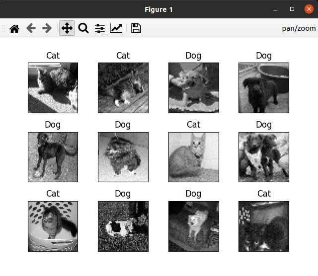
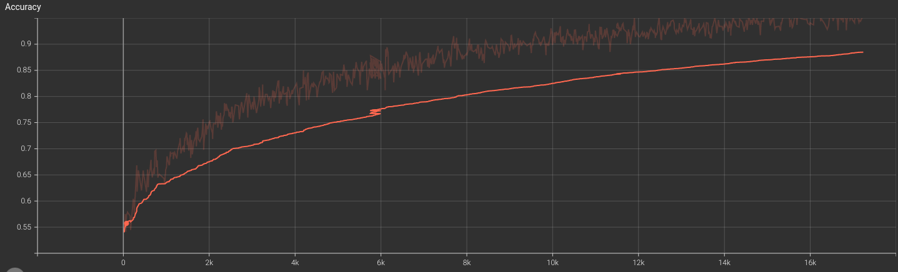
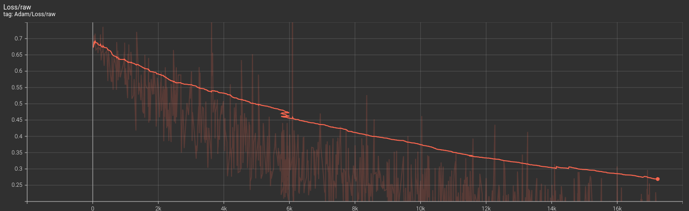

# CatDog-ImageClassifier

# Cat and Dog Image Classification using Neural Networks

This is a project for classifying images of cats and dogs using Convolutional Neural Networks (CNNs). The goal of this project is to train a model to distinguish between cat and dog images based on training datasets and then make predictions on unseen test images.

## Prerequisites

Make sure you have the following Python libraries installed:

- OpenCV (cv2)
- NumPy
- TensorFlow
- TFLearn
- Matplotlib
- tqdm

And install the file with the Test and Train datasets.

 - `www.kaggle.com/competitions/dogs-vs-cats-redux-kernels-edition/data`

## Data

Ensure your training and test datasets contain cat and dog images in the appropriate directories.

After training and creating the 'test' and 'train' datasets using the `main.py`, you can utilize the trained model to make predictions on test images by running the `predict_images.py`.

To initialize TensorBoard and visualize the results, use the following command:

  - `tensorboard --logdir=/path/to/your/log/directory`.

This command will start TensorBoard and point it to the specified log directory, allowing you to view the training and evaluation results of your neural network model.

## Demo Files

In this repository, you will find demo files that illustrate the functionality of our project. These files are provided to help you better understand how to use our solution.

  
  
  

Feel free to explore and experiment with these files to get an idea of what our project can do.

## Accuracy

The accuracy is calculated during training and displayed in the console as the model trains.
The current model has an accuracy of approximately 90%, and I am exploring new ways to enhance and make it more efficient :D

## Customization

You can adjust hyperparameters like image size (IMG_SIZE), learning rate (LR), and the number of training epochs (n_epoch) in the code to optimize model performance.

